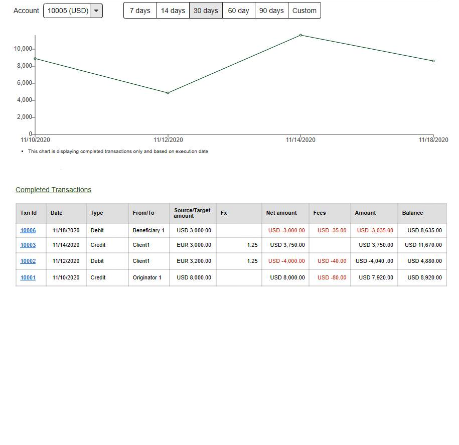

</img>
# Home Assignment

## Setup
1. Fork the project to your Github account (if you are not familiar with forking in github you can follow this [guid](https://docs.github.com/en/get-started/quickstart/fork-a-repo) )
2. install dependencies: `npm i`
3. Run Client app `ng serve`
4. Run Server app `npm run server`

## Assignment Requirements
In the assignment you will create an account's transactions management page:

</img>

### Acceptance Criteria
* create a dropdown with client's account list.
* create filter by date ability for the account's transactions:
  - the filter should have: 7, 30, 60 and 90 last days filters.
  - custom date filter will be a bonus. 
* after selecting an account present the following account info:
    1. The account's balance - the current and starting balance*
    2. Transaction graph - should present the account's balance timeline.
    3. Transaction table of the account's transactions.
    
*The starting balance should be: initial balance - the accumulating amount of the account's transactions.

#### Please right a clean readable code, adding tests (unit/e2e) will be considered a bonus!
#### Good luck!

### API
*  `/api/accounts` -- returns all the client's accounts.
*  `/api/accountInfo/:id` -- returns all the client account's information.

    examples:
   
   ```/api/accountInfo/1```
   
   ```/api/accountInfo/1?fromDate=2021-07&toDate=2021-07-13```
